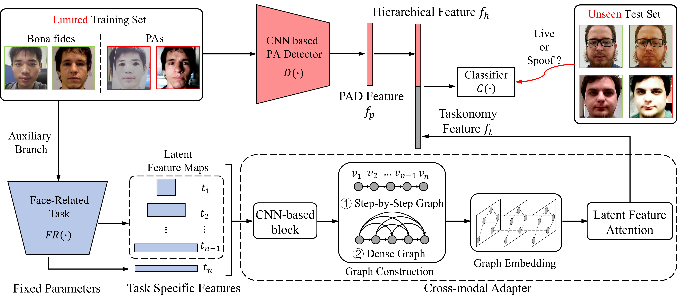

# FRT-PAD
This is an official pytorch implementation of 'Effective Presentation Attack Detection Driven by Face Related Task'.  (Accepted by ECCV 2022)

## Effective Presentation Attack Detection Driven by Face Related Task


* [Paper Home Page](https://wentianzhang-ml.github.io/pad/)

## Requirements

*   numpy>=1.17.0
*   scipy>=1.5.2 
*   Pillow>=8.2.0
*   pytorch>=1.7.1
*   torchvision>=0.8.2
*   tqdm>=4.59.0
*   scikit-learn>= 0.24.2

## Datasets 
The proposed method is evaluated on four publicly-available datasets, i.e. 

*   [MSU-MFSD](https://ieeexplore.ieee.org/abstract/document/7031384)
*   [OULU-NPU](https://ieeexplore.ieee.org/abstract/document/7961798)
*   [CASIA-FASD](https://ieeexplore.ieee.org/abstract/document/6199754)
*   [Idiap Replay-Attack](https://ieeexplore.ieee.org/abstract/document/6313548)


## Usage
The proposed FRT-PAD method is trained through three steps:
*   Data Preparation
    
    Generate the image list:
    ```
    python data_find.py \
    --data_path {Four paths of saved datasets}
    ```
    
    For example, 
    `python data_find.py --data_path ['msu_path', 'casia_path', 'idiap_path', 'oulu_path']`
    
    And then you can get four lists containing images and corresponding labels in './label/' to establish cross-dataset. 
    
 *   Pre-trained Model Preparation
 
     FRT-PAD method consists of CNN-based PA Detector, Face-Related Tasks and Cross-Modal Adapter. For **CNN-based PA Detector** (i.e. baseline), the pre-trained model is carried on ImageNet, and you can download the weights from [resnet18](https://s3.amazonaws.com/pytorch/models/resnet18-5c106cde.pth). For **Face-Related Tasks**, we applied three different models. 
     
 > In **Face Recognition model**, we use a Pre-trained ResNet-18, and you can download the weights from [ms1mv3_arcface_r18_fp16/backbone](https://github.com/deepinsight/insightface/tree/master/recognition/arcface_torch).
 >   
 > In **Face Expression Recognition model**, we also use a pre-trained ResNet-18, and you can download the weights from [SCN](https://github.com/kaiwang960112/Self-Cure-Network).
 >
 > In **Face Attribute Editing model**, we only use its Discriminator, which can be downloaded from [pretrained-celeba-128x128](https://github.com/yunjey/stargan).
     
 *   Training and testing model
     ```
     python train_main.py \
     --train_data [om/ci]
     --test_data [ci/om]
     --downstream [FE/FR/FA]
     --graph_type [direct/dense]
     ```
 
     
   
